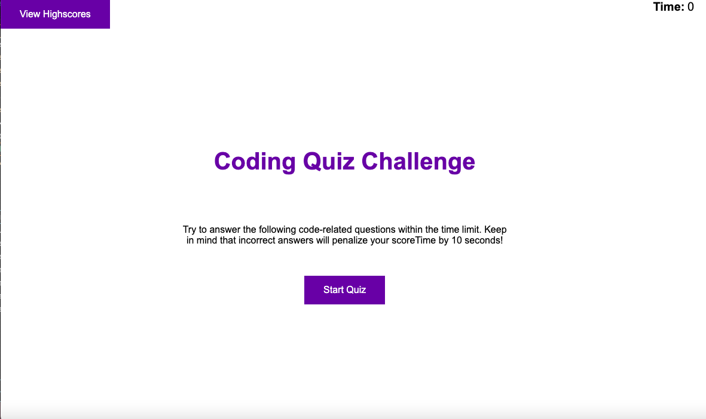
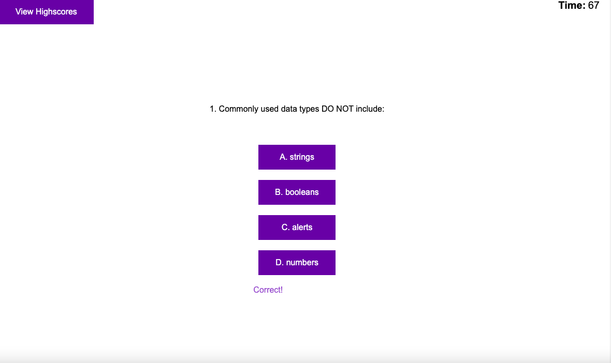
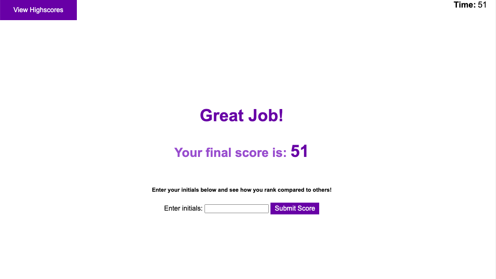
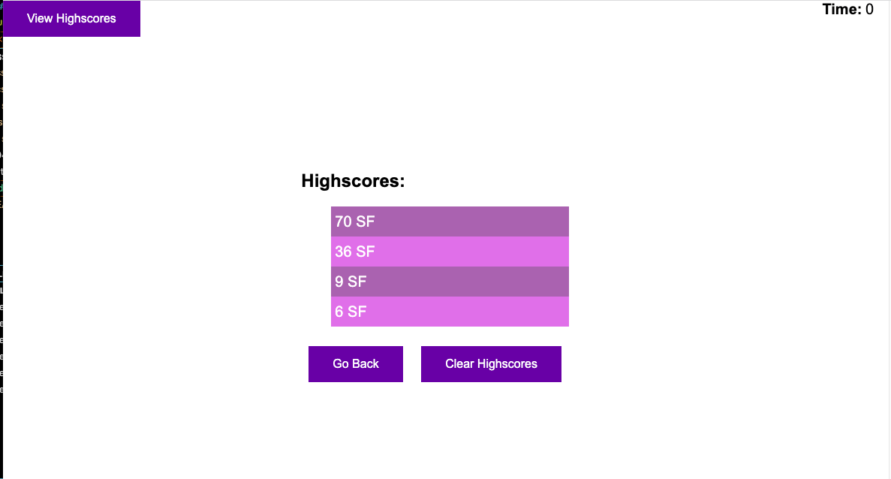

# A Breakdown of Javascript Timed Quiz Challenge

## Purpose of Javascript Timed Quiz Challenge: Exploring Web APIs
This week's challenge allowed for exploration of Web APIs and how they can be used to create interactive web pages such as this quiz. This particular web page is a timed multi-question quiz that takes a user through questions and only moves on to the next question when a user clicks the right question. At the end of the quiz a user has the option of submitting their initials to see where they rank compared to other users who inputed and saved their initials. 

the index.html file has multiple sections with minimal content. Each section represents a different "page" that the user is taken through as they go through the quiz. When the user first travels to the website they are taken to the start-page: 

Here a user can decide to click on the top left button to view highscores or to start the quiz. Once the user starts the quiz, the 75 second timer starts and they are taken to the first question of the quiz: 

If a user clicks the correct answer, a message will display "Correct" at the bottom of the options and move on to the next question. If a user clicks the wrong answer, a message will display "Wrong" and take 10 seconds off of their timer each time a wrong answer is clicked, until a right answer is clicked. Once either the timer runs out (at 10 seconds and lower, the timer becomes red and bigger) or the user finishes the quiz, they will be taken to the user-score-page: 

Here a user's score (based on how much time left they had to take the quiz) is displayed and a user can submit their Initials to be saved on the high score page. Once a user submits their initials, both their initials and scores are stored in an array in local storage and are retrieved and displayed on the high-score page: 

On this page, every score/initial that is stored in the local storage array will be displayed from highest to lowest scores. A user has the option of returning to the start page or clearing the highscores. 

The style.css file contains most of the styling of the page and starts will most of the sections displaying none so that only the start page is shown at first.

The script.js file contains Web API concepts discussed in class such as: 
* Dynamically creating elements
* Setting attributes for those dynamically created elements
* Timer intervals
* Event Listeners
* Preventing default form behavior
* Local storage 

> Please find in the JavaScript file comments that explain each line of code. 

## Link to Javascript Quiz Website: 
[JavaScript Quiz Website](url)